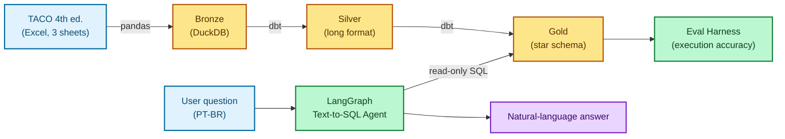

# NutriQuery 🥗

**A natural-language Text-to-SQL agent over a nutritional lakehouse, built on the Brazilian Food Composition Table (TACO, 4th ed., NEPA/UNICAMP).**

Ask questions in Portuguese about the nutritional composition of Brazilian foods and get answers backed by a dimensional data warehouse, validated by a domain-expert-curated evaluation harness measuring *execution accuracy*.

> Example: *"Quanto de proteína tem o frango grelhado?"* → the agent generates SQL, runs it read-only against the warehouse, and answers in natural language.


---

## Why this project exists

Text-to-SQL demos are easy to build and hard to *trust*. Any LLM can emit SQL that looks plausible and returns a wrong number. What makes NutriQuery different is the **evaluation layer**: the gold dataset and reference queries were curated by someone with graduate-level training in physiology, nutrition and biochemistry. That domain lens catches the plausible-but-wrong answers a generic builder would miss, for example:

- Treating a `NULL` nutrient value as `0` (a missing measurement is not "zero of that nutrient").
- Conflating plant-derived ALA omega-3 (flaxseed, walnuts) with marine EPA/DHA, which are biochemically distinct, with single-digit conversion rates in vivo.
- Returning a "top foods" ranking from a nutrient that TACO simply does not measure (e.g. vitamin D).

The project also demonstrates a complete **modern data stack**, end to end:

```
TACO Excel → medallion ELT (bronze → silver → gold) → tested dbt models
           → orchestrated by Dagster → queried by a LangGraph Text-to-SQL agent
             (multi-turn, checkpointed to SQLite)
           → measured by a custom execution-accuracy eval harness
```

Everything runs locally at **zero cost** on Windows 11 + WSL2.

---

## Architecture



---

## Data model (star schema)

Grain of the fact table: **one row per (food × nutrient), per 100 g**.

| Table | Rows | Description |
|---|---:|---|
| `dim_food_group` | 15 | Food groups (cereals, meats, fruits…) |
| `dim_food` | 597 | Individual foods (FK → `food_group_id`) |
| `dim_nutrient` | 67 | Nutrients (protein, lipids, minerals, vitamins, fatty acids, amino acids) |
| `fact_nutrient_values` | 25,296 | Nutrient value per food, per 100 g |

Key column names (intentionally documented because the agent's prompt depends on them):

- `fact_nutrient_values`: `food_id`, `nutrient_id`, `value` *(per 100 g)*
- `dim_food_group`: `food_group_id`, `food_group_name`
- `dim_food`: carries `food_group_id` for the join

---

## The data pipeline (Layer 1)

A medallion architecture over DuckDB:

- **Bronze:** three TACO sheets ingested with pandas. Main composition (597 foods), fatty acids (423 rows), amino acids (26 foods).
- **Silver:** dbt models reshape each source into long format.
- **Gold:** dbt builds the star schema (`dim_*` + `fact_nutrient_values`).
- **Tests:** `not_null`, `unique`, and `relationships` enforce referential integrity.
- **Orchestration:** the whole graph runs as **Dagster** assets (in-process executor to avoid DuckDB write-lock conflicts).

*Proves: ELT, medallion architecture, data quality testing, orchestration.*

---

## The Text-to-SQL agent (Layer 2)

A **LangGraph** state machine:

```
generate_sql → execute_sql → [conditional] → respond → END
                                  │ on error
                                  ▼
                          increment_attempts → generate_sql   (retry, max 3×)
```

Design decisions:

- **LLM:** Groq free tier, `llama-3.3-70b-versatile`, `temperature=0`.
- **Read-only guardrail:** the agent's DuckDB connection is `read_only=True`; it can never modify the warehouse.
- **Self-correction:** on a SQL error, the message is injected back into the prompt and the agent retries (up to 3 attempts).
- **Rate-limit backoff:** the free tier's 429s are retried with exponential backoff, honouring the wait Groq suggests in the error body.
- **Schema-aware system prompt:** a 15-rule prompt encodes table/column descriptions, synonym mappings, `NULL`-semantics and ranking rules (a food with `0` is not "poor" in a nutrient, it simply lacks it, so inverse rankings filter `value > 0`), plus per-group ranking with `RANK()`, cross-group comparison, and conditional `LIMIT` (a "top foods" list is capped, a "per group" or "compared to" answer is not).
- **Accents solved in the data layer, not the prompt:** DuckDB's `ILIKE` is accent-sensitive (`fígado` ≠ `figado`). Rather than asking the LLM to spell Portuguese correctly, the gold dimensions carry `*_normalized` columns (`strip_accents(lower(...))`) that the agent filters on, while the accented column is what gets displayed.

*Proves: agentic tool use, structured output, error handling.*

---

## Conversational memory (Layer 3.5)

The agent is multi-turn. A follow-up with no subject resolves against the conversation:

```
> quanto de proteína tem o frango grelhado?
  → WHERE f.food_name_normalized LIKE '%frango%grelhado%' ... 'proteina_g'
> e de gordura?
  → WHERE f.food_name_normalized LIKE '%frango%grelhado%' ... 'lipideos_g'
```

- **Checkpointing:** LangGraph `SqliteSaver` writes every turn to `db/checkpoints.sqlite`, keyed by `thread_id`. Conversations survive a restart; resume one with `python3 agent.py --thread <id>`.
- **What gets carried:** each assistant turn stores the SQL that produced it. That SQL, not the prose, is what a follow-up inherits its filters from, because it delimits the food exactly (`%frango%grelhado%`) where prose leaves qualifiers ambiguous.
- **Sliding window:** the checkpoint keeps the whole conversation, but only the last 3 turns enter the prompt. Persistence is complete; context stays bounded.
- **History goes in as text, not as a message replay:** the system prompt is a few-shot of bare SQL, so replaying prose assistant turns into the SQL-generation step would teach the model to answer in prose exactly where SQL is wanted.
- **Per-turn state is reset explicitly.** With a checkpointer the previous turn's state persists on the thread: a stale `error` would push a fresh question into the self-correction branch, and an accumulated `attempts` would send it straight to failure. The eval harness compiles the same graph *without* a checkpointer, since cross-question memory there would be contamination.

*Proves: stateful agents, persistence, context engineering.*

---

## The evaluation harness (Layer 3)

A custom **execution-accuracy** harness over a hand-curated gold dataset.

**Gold dataset, 21 questions across 4 difficulty tiers:**

| Tier | Count |
|---|---:|
| `simple_filter` | 5 |
| `join_group` | 6 |
| `aggregation` | 5 |
| `ambiguous` | 5 |

**Column-wise result comparison.** Each gold column has to appear in the agent's result with matching values (defog-style subset by column), and row counts have to match, so a `SELECT *` dump can never pass by accident. Row order is only enforced when the question's semantics require it (declared per question, never inferred from the gold's `ORDER BY`), and questions with ties on the `LIMIT` boundary compare by value set. The comparator is itself guarded by two sanity tests (`test_checks.py`, no LLM): a degenerate whole-table dump must score 0 percent, and each gold fed back as if it were the agent's own answer must score 100 percent. A comparator that fails either test is not trusted.

Five questions deliberately have **no reference result**: their correct behavior is to *refuse* and return an "insufficient data in TACO" message (e.g. vitamin-D rankings, amino-acid questions over foods TACO never measured). The harness validates that refusal too, testing the agent's *epistemic honesty*, not just its arithmetic.

> **Current state.** The complete benchmark now runs in a single pass (21 of 21 questions, none skipped) within the free-tier daily token budget. Latest run: execution accuracy 57 percent (12 of 21), with the static-quality axes (syntactic validity, schema use, safety, efficiency) at 100 percent. Because each report stores the generated SQL, every run is re-scored offline against the current oracle and golds without spending a single token, and that offline re-scoring is what surfaced a bug in one gold query itself (an average where the correct answer was a total, now fixed). Per-run history is generated into `evals/QUALITY_LOG.md`.

*Proves: evaluation rigor, a differentiator that only a minority of AI portfolios demonstrate.*

---

## Project structure

```
nutriquery/
├── data/raw/taco.xlsx          # source (TACO 4th ed.)
├── db/nutriquery.duckdb        # warehouse (regenerable from the pipeline)
├── db/checkpoints.sqlite       # saved conversations (created on first run)
├── ingest_taco.py              # bronze ingestion (main composition)
├── ingest_taco_ag.py           # bronze ingestion (fatty acids)
├── ingest_taco_aa.py           # bronze ingestion (amino acids)
├── prompt.py                   # SYSTEM_PROMPT (15 rules) + RESPONSE_PROMPT
├── agent.py                    # LangGraph Text-to-SQL agent (+ checkpointing)
├── orchestration/
│   ├── assets.py
│   └── definitions.py          # Dagster definitions
├── nutriquery_dbt/
│   └── models/
│       ├── silver/             # *_long.sql
│       └── gold/               # dim_*.sql, fact_nutrient_values.sql, schema.yml
└── evals/
    ├── gold_dataset.json       # 21 curated questions
    ├── generate_gold.py        # runs each gold query, saves reference parquet
    ├── checks.py               # result comparator + static SQL checks
    ├── test_checks.py          # sanity tests for the comparator (no LLM)
    ├── run_evals.py            # harness
    ├── quality_log.py          # re-scores every run, writes QUALITY_LOG.md
    ├── QUALITY_LOG.md          # per-run quality history (generated)
    ├── gold_results/           # reference parquet results
    └── reports/                # per-run JSON reports
```

---

## Setup & run

Requires Windows 11 + WSL2 (Ubuntu) or any Linux, and **Python 3.12 specifically**.
`dbt-core` and `dagster-dbt` cap at `<3.14`, and several pins resolve only on 3.12, so
call `python3.12` explicitly rather than `python3` — on many distros the latter is
already 3.13+ and the install will fail on `Requires-Python`.

```bash
# 1. Clone and enter
git clone https://github.com/<your-user>/nutriquery.git
cd nutriquery

# 2. Create the virtual environment and install deps
python3.12 -m venv .venv
source .venv/bin/activate
pip install -r requirements.txt

# 3. Set your free Groq API key (https://console.groq.com)
export GROQ_API_KEY=your_key_here

# 4. Build the warehouse (bronze → silver → gold)
python3 ingest_taco.py && python3 ingest_taco_ag.py && python3 ingest_taco_aa.py
cd nutriquery_dbt && dbt build && cd ..

# 5. Talk to the agent  (prints a thread id you can resume later)
python3 agent.py
#   > quanto de proteína tem o frango grelhado?
#   > e de gordura?          (follow-up: resolves against the conversation)
#   > sair  (to exit)

# 5b. Resume a saved conversation
python3 agent.py --thread cli-a3f9c1

# 6. (optional) Inspect orchestration
dagster dev -m orchestration.definitions   # UI at http://127.0.0.1:3000

# 7. (optional) Run the eval harness  (needs Groq token budget)
python3 evals/run_evals.py
```

---

## Known limitations of TACO 4th ed.

| Nutrient | Situation |
|---|---|
| Vitamin D | No data for any of the 597 foods |
| Amino acids | Data for only 26 foods |
| Omega-6 (LA) | Not disaggregated; proxy: `ag_poliinsaturados_g` |
| Portions | No portion table; all values are per 100 g |

These are surfaced honestly by the agent rather than papered over, which is the whole point of the domain-curated eval layer.

---

## Roadmap

The project is a deliberate stopping point at Layer 3.5 (a complete, self-contained portfolio piece). Planned extensions:

- **Layer 4 (Observability / LLMOps).** Langfuse tracing per run (generated SQL, latency, tokens, cost), eval-metrics dashboard over time.
- **Layer 5 (Hybrid routing + portion math).** A router agent that sends factual questions to Text-to-SQL and conceptual questions to RAG over a nutrition corpus, plus a `parse_portions` node for queries like *"calorias de 2 bananas e 2 ovos"*.
- **Layer 6 (Deploy).** FastAPI + Streamlit on a free host (HF Spaces / Fly.io), with a live demo link.

---

## Tech stack

| Layer | Tool |
|---|---|
| Source | TACO 4th ed. (NEPA/UNICAMP) |
| Bronze ingestion | Python + pandas |
| Warehouse | DuckDB |
| Transformation | dbt-core + dbt-duckdb |
| Orchestration | Dagster |
| Agent framework | LangGraph |
| LLM | Groq free tier (`llama-3.3-70b-versatile`) |
| Evaluation | Custom execution-accuracy harness |

---

## Author

**Mateus Camara Dias**, São José, SC, Brazil.
Career transitioner into Data & AI Engineering, with a graduate background in physiology, nutrition and biochemistry, used here as a genuine domain differentiator in the evaluation layer.

---

*TACO (Tabela Brasileira de Composição de Alimentos) is published by NEPA/UNICAMP and used here for educational, non-commercial purposes.*
